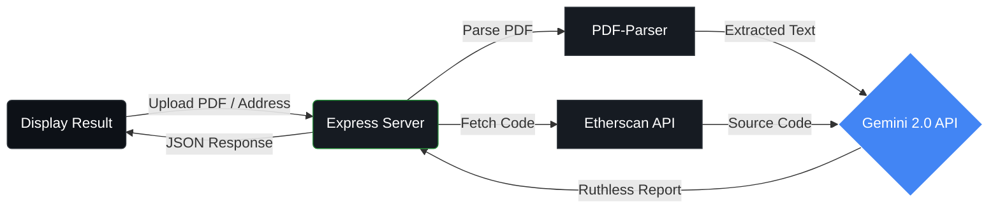

<div align="center">

# 💀 Crypto Ruthless Auditor

**Brutal AI Audits for Crypto Whitepapers & Smart Contracts.**  
_Don't get rugged. Let AI roast the red flags first._

[](https://opensource.org/licenses/ISC)
[](https://deepmind.google/technologies/gemini/)
[](https://nodejs.org/)
[](https://www.docker.com/)

[**View Demo**](https://huggingface.co/spaces/krsnmlna1/crypto-auditor) · [**Installation**](#-installation) · [**Report Bug**](https://github.com/your-username/crypto-auditor/issues)

---

## ⚡ Features

- **📄 Ruthless PDF Analysis**: Upload any crypto whitepaper. The AI scans for vague promises, Ponzi-like structures, and centralization risks.
- **👾 Smart Contract Audit**: Paste a verified contract address. The AI pulls the code from Etherscan and hunts for reentrancy attacks, honeypots, and backdoors.
- **🤬 Savage Persona**: No sugar-coating. The report is delivered with skepticism and brutal honesty.
- **🚀 Fast & Free**: Powered by Google's Gemini 2.0 Flash via OpenRouter.

---

## 🏗️ Architecture

How does it work? Simple but powerful. The user provides a target, and our backend orchestrates the takedown.



---

## 📦 Installation

Get the auditor running locally in less than 2 minutes.

### 1. Clone & Install

```bash
git clone https://github.com/your-username/crypto-auditor.git
cd crypto-auditor
npm install
```

### 2. Configure Secrets

Create a `.env` file in the root directory:

```env
OPENROUTER_API_KEY=your_key_here
ETHERSCAN_API_KEY=your_etherscan_key_here  # Optional, for contract audits
```

### 3. Run It

```bash
npm start
# 🚀 Server running at http://localhost:7860
```

---

## 🖼️ Gallery

> "Most whitepapers are fluff. This tool cuts through the noise."

|                       Whitepaper Audit                        |                    Contract Audit                     |
| :-----------------------------------------------------------: | :---------------------------------------------------: |
| The AI reads the entire PDF and highlights logical fallacies. | It checks Solidity code for critical vulnerabilities. |

---

## ⚠️ Disclaimer

**This tool is for educational and entertainment purposes only.**
The "Skeptical Auditor" persona is designed to be harsh. Do not take financial advice from an AI. **DYOR (Do Your Own Research)**.

---

<div align="center">
  <sub>Built with 💀 and ☕ by <a href="https://github.com/your-username">You</a></sub>
</div>
