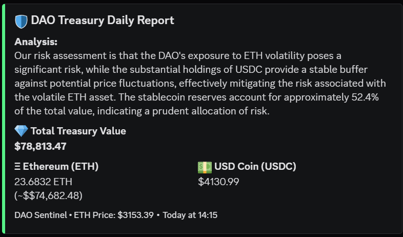

# 🛡️ DAO Sentinel Bot

**Automated Web3 Treasury Monitor with AI Risk Analysis**

DAO Sentinel is a Node.js agent designed to monitor DAO treasury wallets. It tracks multi-asset holdings (ETH & USDC), calculates real-time fiat valuation using CoinGecko, and utilizes Large Language Models (LLM) to generate natural language risk assessments sent directly to Discord.

## 📸 Snapshot

## 🚀 Key Features

- **Multi-Asset Tracking:** Monitors Native ETH and ERC-20 tokens (USDC) via Smart Contract calls.
- **AI-Powered Insights:** Uses OpenRouter to analyze portfolio risk ratios (Volatility vs Stability).
- **Real-Time Data:** Integrates CoinGecko API for live price feeds.
- **Rich Reporting:** Delivers formatted visual reports (Embeds) via Discord Webhooks.

## 🛠️ Tech Stack

- **Core:** Node.js, Ethers.js v6
- **AI:** OpenAI SDK (routed to Llama 3 / Gemini via OpenRouter)
- **Data:** CoinGecko API, RPC Providers
- **Notification:** Discord Webhooks

## 📦 How to Run

1.  Clone the repo: `git clone https://github.com/krsnmlna1/dao-sentinel.git`
2.  Install packages: `npm install`
3.  Setup `.env` file with your API Keys (RPC, OpenAI, Discord).
4.  Run: `node index.js`
