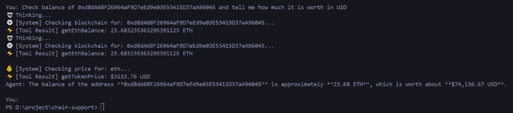

# 🤖 ChainSupport AI

**Conversational Web3 Assistant with Autonomous Function Calling**

ChainSupport is an AI Agent powered by OpenAI's LLM that can interact with the Ethereum blockchain. Unlike standard chatbots, it has "tools" to fetch real-time on-chain data (balances, gas prices) and market data (CoinGecko) to answer user queries accurately.

## 🧠 Core Capabilities (The "Tools")

The AI is equipped with the following custom functions:

- `getEthBalance(address)`: Queries RPC nodes for live wallet balances.
- `getGasPrice()`: Fetches current network fees (Gwei) to advise users on transaction costs.
- `getTokenPrice(ticker)`: Retrieves real-time fiat valuations via CoinGecko API.

**✨ Key Feature: Multi-Step Reasoning**
The agent can chain multiple tools together. For example, if asked _"What is the USD value of Vitalik's wallet?"_, it will autonomously:

1.  Fetch the ETH balance.
2.  Fetch the ETH price.
3.  Calculate and respond with the final USD value.

## 📸 Demo

## 🛠️ Tech Stack

- **Runtime:** Node.js
- **AI Engine:** OpenAI SDK (Function Calling / Tool Use enabled)
- **Blockchain:** Ethers.js v6
- **Data:** Ankr RPC & CoinGecko API

## 📦 Usage

1.  Clone repo.
2.  `npm install`
3.  Setup `.env` (RPC_URL, OPENROUTER_API_KEY).
4.  Run: `node index.js`
